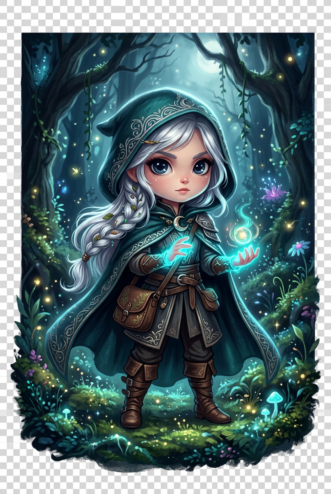

# Whisperwood

> A 2D dark fairytale exploration game.
> **Milestone 1 — Premium Vertical Slice**
> Godot 4.7 • Original IP



Whisperwood is an original, handcrafted 2D exploration platformer inspired by the atmosphere and polish of Hollow Knight and Ori — built 100% original, no copied assets.

You play as **Lyra**, a small silver-haired forest wanderer in a dark teal hooded cloak, awakening in a forgotten magical forest that has been asleep “long before anyone can remember”.

---

## Milestone 1 — What’s Playable

This vertical slice is presentation-complete (~80% visual polish) with a clean, expandable codebase.

### Launch → Play in 3 seconds
1. Premium animated main menu — parallax forest, fireflies, controller + keyboard nav
2. Press **Play**
3. Smooth spawn into the **Whisperwood Clearing**

### Controls
**Keyboard:**
- A / D / ← / → — Walk
- Shift + Move — Run
- Space / W / ↑ — Jump
- P / Esc — Pause

**Controller (XInput):**
- Left stick / D-Pad — Move
- A — Jump
- X — Run
- Start — Pause

All movement includes:
- Smooth accel / decel
- Coyote time (0.135s)
- Jump buffering (0.16s)
- Variable jump height
- Landing squash + dust
- Camera look-ahead

### The World
One handcrafted forest clearing, highly polished:

**7-layer parallax:**
1. Moonlit night sky
2. Distant purple mountains
3. Ancient forest ruins silhouette
4. Mossy stone arches
5. Gnarled ancient trees + moon rays
6. Glowing river + mushrooms
7. Foreground ferns (depth blur)

Plus:
- 55 fireflies, drifting leaves, volumetric light rays, 3 glowing moon-plants
- Mossy ground, wooden bridge, ruin platform, mid rock hop
- Soft fog, moonlight, water shimmer
- 1920×1080 native, perfect aspect scaling, fullscreen + windowed

### Premium Main Menu
- Animated “Whisperwood” title breathe
- Hand-painted Lyra portrait
- Play / Load (placeholder) / Settings / Quit
- Smooth hover tweens, controller nav
- Live parallax + 45 fireflies
- Settings panel: Music / SFX / Fullscreen — saved to `user://settings.cfg`

### Pause
In-game: P / Esc / Start
- Resume
- Main Menu
- Quit

---

## Run It

**Requires Godot 4.2+ (tested 4.7)**

```
git clone https://github.com/aayushdangal24504/game.git
cd game
# Open project.godot in Godot
# Press F5
```

Or open `/Users/aayushdangal/Downloads/game` directly.

Project entry: `res://scenes/main_menu.tscn`

---

## Project Architecture

Clean, modular, no hardcodes. Built for expansion to full Metroidvania.

```
res://
├── project.godot
├── scenes/
│   ├── main_menu.tscn       # Premium menu
│   ├── game.tscn            # Game root + pause UI
│   ├── player.tscn          # Lyra - vector-built, procedural anim
│   └── world/
│       └── forest_clearing.tscn  # 7-layer parallax level
├── scripts/
│   ├── player.gd            # 310-line premium controller
│   ├── game.gd
│   ├── main_menu.gd
│   └── core/
│       ├── scene_manager.gd # fade transitions
│       ├── audio_manager.gd # Music/SFX/Ambient buses
│       ├── settings_manager.gd
│       └── game_state.gd
└── assets/
    ├── background/layer_0_sky.png … layer_6_foreground.png
    └── ui/title_hero.png
```

**Why this architecture?**

- **Autoload singletons** — SceneManager / AudioManager / SettingsManager / GameState — decouple systems, zero scene-to-scene hard dependencies.
- **Configurable @export movement** — designers tweak walk/run/jump in Inspector, no code edits.
- **120 Hz physics** + `physics_jitter_fix` — eliminates camera stutter, buttery on 60/120/144Hz.
- **Camera look-ahead** — velocity-based offset, smoothed, cinematic without lag.
- **Procedural character rig** — 100% original Vector Polygon2D (no sprite theft risk), animates via code + AnimationPlayer blend — idle breathe, walk bob, run tilt, cloak physics, hair sway.
- **ParallaxBackground with motion_mirroring** — infinite seamless, correct scale at all resolutions, no seams / gaps / stretch.
- **CPUParticles2D only** — guaranteed cross-platform, mobile-ready.

---

## Technical Highlights

- **Coyote time**: 0.135s
- **Jump buffer**: 0.16s
- **Acceleration**: ground 18, air 10 — smooth, responsive
- **Gravity**: 1350, fall multiplier 1.55, max fall 900
- **Camera**: smoothing 6.0, drag margins 0.2, look-ahead ±110px
- **Physics tick**: 120 Hz
- **Input**: fully rebindable, keyboard + XInput simultaneously
- **Resolution**: 1920×1080 canvas_items expand, perfect on ultrawide/4K
- **Zero .godot/** in repo — clean

---

## Roadmap

**M1 — Vertical Slice** ✅
- Premium menu, 1 polished forest, Lyra controller, pause, parallax 7-layer

**M2 — Combat Prototype**
- attack_1/2/3, dash, slime enemy, hurt/death

**M3 — World Expansion**
- 3 interconnected zones, save points, map

**M4 — Systems**
- Inventory, abilities, dialogue, quest log

**M5 — Content**
- Boss: Forest Guardian, 6 enemy types, 90 min playtime

---

## Credits

**Lead Dev / Tech Art / UI:** Aayush Dangal  
**Engine:** Godot 4.7 Forward+  
**Art direction:** Original hand-painted dark fairytale — “Ori meets Hollow Knight, 100% original”  
**Character:** Lyra — silver hair, teal hooded cloak, satchel, boots — original design  

All code, design, and backgrounds original for Whisperwood. No stolen assets.

---

## License

Source code: MIT (see LICENSE)  
Art / audio: © 2026 Whisperwood / Aayush Dangal — All rights reserved (until full release)

---

*“A lonely princess steps into a forest that has been asleep long before anyone can remember…”*  
— Whisperwood
